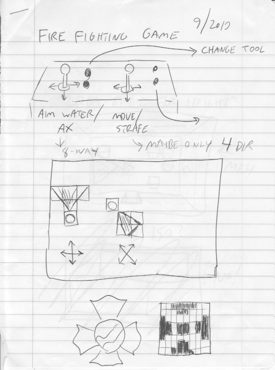

# Firefighter Design Documents

Original hand-written design documents for "Firefighter", a twin-stick
firefighting action game for the Atari 8-bit.

## Credits
By Bill Kendrick <bill@newbreedsoftware.com>  
http://www.newbreedsoftware.com/firefighter/

Drawn 2019-Sept.  Scanned and documented 2023-09-25.

------------------------------------------------------------------------

This folder contains scans of the original design documents I
created four years prior to actually beginning to code Firefighter.
Please see the [Development Docs](../DEVELOPMENT.md) for details on
how the game was actually created.

------------------------------------------------------------------------

## Page 1

* Heading: "Fire Fighting Game 9/2019"
* Drawing of a twin-stick joystick controller
  * Left joystick labeled "Aim Water / Ax → 8-Way"
  * Right joystick labeled "Move / Strafe → Maybe only 4 Dir"
  * Left firebutton labeled "Change Tool"
  * Right firebutton has an arrow, but not labeled
* Diagram showing two grids containing the player (as a circle) and four
  grid squares containing water spray.
  * One is labeled with ┼ up/down/left/right arrows; the spray is above,
    one grid above the player, and three grids above that.
  * One is labeled with ╳ diagonal; the spray is down and to the right,
    in a 2x2 square.
* Drawing of a ✠ Maltese Cross (firefighter badge), and an 8x8 grid
  with black and white pixel art representing that shape.

### Notes:

I dropped the idea of changing tools (hose/spray and ax), and hence
firebuttons are not using in gameplay.

------------------------------------------------------------------------

## Page 2

* Heading: "Zelda-style, for height?"
  * Drawing of a top-down view of a room, with walls viewed at an
    angle, like those of the original NES _Zelda_.
  * Boxes in the room appear in three-quarter (top and one side).
  * The firefighter and fire appear as profile.
  * The word "←MEH" (dismissing the idea) appears next to it.
* Heading: "ISO?"
  * Scribbled out, the beginning of a drawing of a rectangular solid
    in an isometric view.
  * The word "←NO!" (seriously dismissing the idea) appears next to it.

### Notes:

When I finally created the game, I went with extremely simply graphics.
In the style of many 1980s video games, it is a top-down view, but
objects appear in profile.

------------------------------------------------------------------------

## Page 3

* Heading: "Water"
  * Similar to page 1, but as collections of 4x4 grids containing
    pixel art, the water spray shape was drawn facing up and
    down-and-right.
  * Below, the forumulas "3 x 4 = 12 + 4 x 4 = 16" and
    "12 + 16 = 28 if chars" are shown to (mis)calculate how many
    shapes in the font (characters) would be needed to represent
    the water.
  * Below that, "or 2-3 players if PMG", with "2→horiz/diag" and
    "3→vertical"; an attempt to calculate how many players ("sprites")
    of Player/Missle Graphics (PMG) would be needed to represent
    the water.
* Heading: "Flame"
  * Three sizes of flames (small, medium, and large).
* Heading: "Gas Leak"
  * Narrow gas leak shapes, in four directions (up, down, right, and left).

### Notes:

I miscalculated how many characters were needed for water spray in
the cardinal directions; it was also four.  So for 8 directions,
32 characters have been used.  (And Player/Missile Graphics were not.)
The flame and gas leak design remained intact.

------------------------------------------------------------------------

## Page 4

* "Crate" and "Broken Crate"
  * 8x8 grid with pixel art of a crate and broke crate.
* "Switch" (with a large "?" question-mark)
  * Drawings (not pixel art) of large blade switches in up and down
    positions.
* "Oil Tank"
  * Drawing (not pixel art) of a large metal barrel with the word
    "OIL" drawn vertically down the center.
* "Valve Ctrl"
  * Drawing (not pxiel art) of a valve operator.
* "Pipe"
  * Drawing of two horizontal and one corner segment of pipes.
* Various shapes representing the characters for piping:
  horizontal, four corners, vertical, horizontal with gas leaks
  above and below, a valve operator, and vertical with gas leaks
  to the left and right.
  * Labeled "9 chars"
  * Leaking pipes labeled "Cracked, for gas leaks"

### Notes:

I never had any idea what switches could be used for, so they
were dropped.  The pipes and valves actually required 10 characters,
since the valve operator has two shapes, indicating open vs closed.
Everything else here was utilized.

------------------------------------------------------------------------

## Page 5

* "Leave Hose Trail?"
  * "Need to double back to clear path for pushing crates (Sokoban)?"
* "Extinguisher vs Hose?"
  * Extinguisher → "No trail, limited use"
  * Hose → "Unlimited, trail"
* "Two screen buffers, flicker to overlay fire (& water?)"
  * "Playfield" -- rectangle containing a simple overview of some walls
    and obstacles
  * "+" (plus)
  * "Fire only" -- rectangle containing some fire
  * "~ OR ~"
  * "PF [Playfield] duplicated with fire → less flicker" -- rectangle
    containing both a simple overview of walls and obstacles, and fire

### Notes:

* I opted for a middle ground when it came to the water spray; no hose
  trail _and_ unlimited water supply.
* I did not create two screen buffers; in the game as implemented,
  fire cannot occupy the same location as other objects (walls,
  crates, etc.).

------------------------------------------------------------------------

## Page 6

* Heading: "Goals"
  * "Put out fire"
  * "Rescue people → grab & drag"
  * Three rectangles showing some walls, the firefighter, and people:
    * The firefighter and a right-arrow (→) pointing towards a person.
    * The firefighter one position to the right, next to the person.
    * Both the firefighter and person one position to the left, with
      a left-arrow (←) to the left of them.
* "Ax as pick-up item? (so can't simply break all crates)

### Notes:

These are the goals of the game as developed.  One thing that wasn't
covered was how the game ends; e.g. can the player (firefighter) die?

------------------------------------------------------------------------

## Page 7

* Heading: "Fire as 'Game of Life'"
  * "Sokoban crate pushing should move fire too."

### Notes:

* The game does run as a cellular automata.
* In the game as implemented, crate pushing does not move fire.
  (However, you *can* push workers and barrels.)

