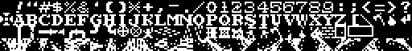
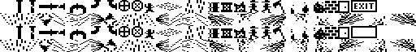

# Firefighter Fonts

Fonts (character sets / tile graphics) for "Firefighter", a twin-stick
firefighting action game for the Atari 8-bit.

## Credits
By Bill Kendrick <bill@newbreedsoftware.com>  
http://www.newbreedsoftware.com/firefighter/

Documented 2023-09-25 - 2025-01-20.

------------------------------------------------------------------------

This folder contains the two fonts (character sets, aka tile graphics)
used by this game.  Please see the [Development Docs](../DEVELOPMENT.md)
for additional details.

Originally, the game used just two character sets, with a few shapes
that different to provide two frames of animation (fire, water spray,
gas leaks, the exit sign, and workers).

-  
Earlier font, with 8x8 tile graphics from earlier beta releases of the game.

Later, a larger set of tiles were created that allow for higher resolution
shapes in the game (8x16 pixels, rather than 8x8 pixels, while taking
up the same amount of space on a 20x11 map of tiles).  A simple PHP
script, [`shape_pbm_to_fnt.php`](../tools/shape_pbm_to_fnt.php), was
created that generates four full fonts based on the text font, and a bitmap
graphic.

-  
High resolution (8x16) tile graphics now used in the game.

The numerals, punctuation, and uppercase characters are meant to
evoke the letters seen on the side of a firetruck in the US.

The first half of the font is used on lines of text -- the top large
line of text on the title screen and in-game, and the smaller lines
of text on the title screen and status bar in-game.  Four special
characters are amongst them:

* `@` -- ✠ Maltese Cross (firefighter badge); used in the title
* `]` -- ax; used in game to indicate you've collected the ax
* `^` -- 🔥 fire; used in game to represent how many workers have perished
* `_` -- ↵ carriage return; used when entering high score initials

The first 59 characters (ATASCII / ASCII space through `Z`) may be entered
as high score initials.

The second half of the font is used as in-game tile graphics,
representing both objects and obstacles, as well as the player,
workers, fire, gas leaks, and water.  (See [shapes.h](../src/shapes.h).)

* Blank
* Vertical pipe
* Vertical pipe, damaged
* Horizontal pipe
* Horizontal pipe, damaged
* Pipe connecting down to right
* Pipe connecting down to left
* Pipe connecting up to left
* Pipe connecting up to right
* Valve operator, open
* Valve operator, closed
* Worker
* Gas leak, spraying right
* Gas leak, spraying left
* Gas leak, spraying down
* Gas leak, spraying up
* Barrel
* Crate
* Crate, damaged
* Firefighter, facing left
* Firefighter, facing right
* Ax
* Fire, small
* Fire, medium
* Fire, large
* Brick wall
* Door
* Exit sign, left half
* Exit sign, right half
* (Unused!)
* (Unused!)
* (Unused!)

The final 32 characters all represent the 8 directions the
water sprays can occur:

* Up (North):
  * Far left
  * Far center
  * Far right
  * Near
* Left (West):
  * Far top
  * Far middle
  * Far bottom
  * Near
* Down (South):
  * Near
  * Far left
  * Far center
  * Far right
* Right (East):
  * Near
  * Far top
  * Far center
  * Far bottom
* Right-Down (Southeast):
  * Near
  * Far top-right
  * Far center
  * Far bottom-left
* Left-down (Southwest):
  * Far top-left
  * Near
  * Far center
  * Far bottom-right
* Right-up (Northeast):
  * Far top-left
  * Far center
  * Near
  * Far bottom-right
* Left-up (Northwest):
  * Far center
  * Far top-right
  * Far bottom-left
  * Near

